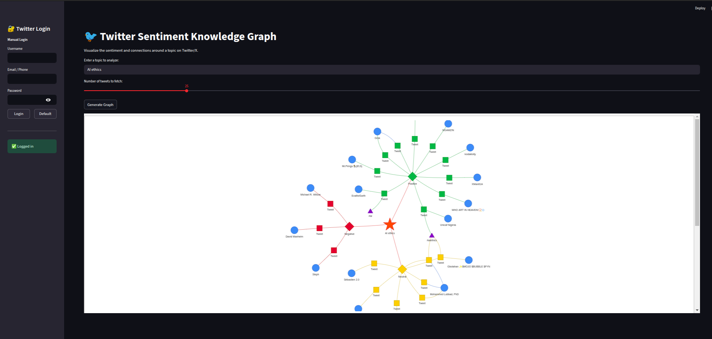

# 🐦 Twitter Sentiment Knowledge Graph Visualizer

An interactive web application built with Streamlit to analyze and visualize the sentiment landscape of any topic on Twitter/X.

This tool fetches real-time tweets, performs advanced sentiment analysis using a transformer-based model, and renders the results as a dynamic, interactive knowledge graph. It helps uncover relationships between users, tweets, and shared themes (hashtags), providing a unique perspective on public discourse.

## \#\# ✨ Features

  * **Real-time Data:** Fetches the latest tweets for any search topic using the `twikit` library.
  * **Advanced Sentiment Analysis:** Utilizes the `cardiffnlp/twitter-roberta-base-sentiment-latest` model for high-accuracy, context-aware sentiment classification (Positive, Negative, Neutral).
  * **Interactive Knowledge Graph:** Dynamically generates and displays a hierarchical graph where you can explore connections between the central topic, sentiments, individual tweets, and users.
  * **Thematic Clustering:** Automatically identifies tweets that share common hashtags and links them together, revealing sub-topics within the conversation.
  * **Secure Login:** Supports both manual login and a quick "Default" login using credentials stored securely in a `.env` file.
  * **Persistent Storage:** Saves analyzed tweet data into an SQLite database for future reference.

-----

## \#\# 🛠️ Technology Stack

  * **Frontend:** [Streamlit](https://streamlit.io/)
  * **Twitter/X API:** [Twikit](https://www.google.com/search?q=https://github.com/d8745/twikit)
  * **Sentiment Analysis:** [Hugging Face Transformers](https://huggingface.co/docs/transformers/index) (`PyTorch` backend)
  * **Graph Data Structure:** [NetworkX](https://networkx.org/)
  * **Graph Visualization:** [Pyvis](https://pyvis.readthedocs.io/en/latest/)
  * **Database:** SQLite3
  * **Configuration:** `python-dotenv`

-----

## \#\# ⚙️ Setup and Installation

Follow these steps to get the application running on your local machine.

#### **1. Prerequisites**

  * Python 3.9+
  * Git

#### **2. Clone the Repository**

```bash
git clone <your-repository-ssh-url>
cd <your-repository-name>
```

#### **3. Set Up a Virtual Environment**

It's highly recommended to use a virtual environment to manage project dependencies.

```bash
# Create a virtual environment
python -m venv .venv

# Activate it (Linux/macOS)
source .venv/bin/activate

# On Windows, use:
# .venv\Scripts\activate
```

#### **4. Install Dependencies**

Install all required libraries from the `requirements.txt` file.

```bash
pip install -r requirements.txt
```

#### **5. Configure Credentials**

The application uses a `.env` file to securely manage your Twitter/X credentials.

First, create a `.env` file by copying the example:

```bash
cp .env.example .env
```

Next, open the newly created `.env` file and fill in your details:

```
# .env
TWITTER_USERNAME="your_twitter_username"
TWITTER_EMAIL="your_twitter_email_or_phone"
TWITTER_PASSWORD="your_twitter_password"
```

*Note: This file is included in `.gitignore` and will not be committed to your repository.*

-----

## \#\# 🚀 How to Run the Application

Once the setup is complete, you can launch the Streamlit application with a single command:

```bash
streamlit run app.py
```

This will automatically open a new tab in your web browser. Use the sidebar to log in, then enter a topic in the main panel and click "Generate Graph" to begin the analysis.

## 🖼️ Streamlit UI and Sample Result

Below is an example of the Streamlit application's user interface and a sample result of the sentiment analysis.

### Streamlit UI
The application features an intuitive sidebar for user login and topic input. The main panel displays the generated knowledge graph and sentiment statistics.

### Sample Result
After entering a topic and running the analysis, the application generates a dynamic knowledge graph. Nodes represent tweets, users, and hashtags, while edges indicate relationships. Sentiment statistics are displayed alongside the graph.



-----

## \#\# 📂 Project Structure

```
.
├── app.py                  # The main Streamlit application UI
├── knowledge_graph.py      # Class for building the NetworkX graph
├── twitter_client.py       # Class for handling Twikit API calls and login
├── sentiment_analyzer.py   # Logic for sentiment classification with Transformers
├── database.py             # SQLite database initialization and functions
├── requirements.txt        # List of Python dependencies
├── .gitignore              # Specifies files for Git to ignore
├── .env                    # Your secret credentials (you must create this)
└── README.md               # This file
```

-----

## \#\# 📄 License

This project is licensed under the MIT License. See the `LICENSE` file for details.